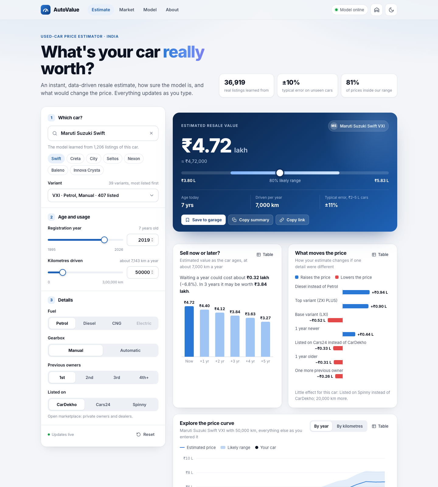

# AutoValue: used-car price prediction

A complete machine-learning project that estimates the resale price of a used car in India
(in lakhs of rupees), tells you how sure it is, and serves the result through a **FastAPI** API and
the **AutoValue** website (hand-built HTML, CSS and JavaScript, light and dark themes).



| | |
|---|---|
| **Problem** | Supervised regression: predict the asking price from brand, model, **variant**, age, kilometres, fuel, gearbox, owners and platform |
| **Data** | 40,440 listings from **CarDekho, Cars24 and Spinny collected in 2025–2026**, **36,919 unique** after cleaning, cars registered up to 2026 (see [DATA_SOURCES.md](DATA_SOURCES.md)) |
| **Best model** | Hist Gradient Boosting (tuned), chosen from 9 algorithms by 5-fold cross-validation (most accurate model that fits in 40 MB) |
| **Accuracy on unseen cars** | typical error **9.8%**, mean error **1.14 lakh**, R² **0.86** |
| **Price range** | 80% range that really covers **81.0%** of unseen cars |
| **Stack** | Python 3.12, pandas, scikit-learn, FastAPI, Pydantic, HTML/CSS/JavaScript (no framework), pytest |

## Quick start

Run everything from this folder. Python **3.12** is recommended (`runtime.txt`).

```bash
python3.12 -m venv .venv
source .venv/bin/activate            # Windows: .venv\Scripts\activate
pip install -r requirements.txt
```

The trained model is already included (`models/`, 2.4 MB), so you can run it straight away. **One command starts
both the website and the API:**

```bash
uvicorn main:app --reload
```

| Open | What it is |
|---|---|
| http://127.0.0.1:8000 | the **AutoValue website** |
| http://127.0.0.1:8000/docs | the interactive API documentation |

The website needs no build step and no internet connection (only the Inter font is fetched from Google Fonts; without
it the page falls back to the system font).

The older Streamlit version of the app still works too: `streamlit run streamlit_app.py` (http://localhost:8501).

Other commands:

```bash
python build_dataset.py    # step 1: rebuild data/used_cars_india.csv from the 4 sources (seconds)
python train.py            # step 2: retrain everything (about 20 minutes); rewrites models/ and reports/
python train.py --quick    # retrain without hyper-parameter tuning (about 3 minutes)

pip install -r requirements-dev.txt
pytest                     # 94 tests
```

> If you see a scikit-learn version warning, run `python train.py` once to rebuild the model for your installed version.

## The website

| Page | What it shows |
|---|---|
| **Estimate** | Search any of 424 models, pick the exact **variant** (it fills in the usual fuel and gearbox), set year and kilometres with sliders and the rest with one tap. The price updates live, with its likely range and the typical error for that price band. Below it: **Sell now or later?** (value over the next 5 years), **What moves the price** (the same car as the base or top variant, another fuel, gearbox, owner count or platform), a price curve by year or kilometres, and the closest **real listings** (same variant first) |
| **Market** | The 2025–2026 market in numbers: price distribution, price by year, by brand, fuel, gearbox, ownership and platform, how fast the big four brands lose value, and a filterable table of popular models (one click estimates a typical example) |
| **Model** | Test-set scores, how the model was built, the 9-algorithm comparison, actual vs predicted for every test car, feature importance, accuracy by price band, and plain-English explanations |
| **About** | Problem, data, method, results, limitations and how to call the API |

Other features:
- **Garage**: save estimates and compare them side by side (stored in your browser).
- **Share**: copy a link that reopens the exact estimate, or copy a text summary.
- **Light and dark themes**: follows your system setting, with a toggle in the top bar.
- **Works on phones**: on small screens a price bar at the bottom always shows the current estimate.
- **Accessible**:
  - Every chart has a Table view, and hover tooltips can also be reached with the arrow keys.
  - The whole form works with the keyboard alone.
  - Chart colours are checked for colour-blind safety in both themes.
- **Helpful errors**: a misspelt car gets clickable suggestions, and a stopped server shows a clear message.

Screenshots: [market](docs/screenshots/2_market_insights.png), [model](docs/screenshots/3_model_performance.png),
[about](docs/screenshots/4_about.png), [dark theme](docs/screenshots/5_dark.png), [phone](docs/screenshots/6_phone.png).

## Results

Cross-validation (CV) is used to compare algorithms; the 7,384-car **test set** was used once, at the end.

| Algorithm | CV error (lakh) | CV R² | CV typical error | Test error (lakh) | Test R² | Size |
|---|---|---|---|---|---|---|
| Extra Trees | 1.166 | 0.820 | 10.4% | 1.145 | 0.867 | 110 MB |
| Extra Trees (tuned) | 1.168 | 0.820 | 10.4% | 1.148 | 0.867 | 74 MB |
| **Hist Gradient Boosting (tuned)** (chosen) | 1.190 | 0.818 | 10.3% | 1.137 | 0.863 | **2.4 MB** |
| Random Forest | 1.206 | 0.819 | 10.8% | 1.163 | 0.872 |  |
| Random Forest (tuned) | 1.208 | 0.819 | 10.8% | 1.166 | 0.873 |  |
| Hist Gradient Boosting | 1.254 | 0.808 | 10.9% | 1.212 | 0.851 |  |
| Ridge Regression | 1.360 | 0.777 | 11.2% | 1.361 | 0.787 |  |
| Linear Regression | 1.363 | 0.777 | 11.3% | 1.362 | 0.784 |  |
| K-Nearest Neighbours | 1.382 | 0.777 | 11.9% | 1.333 | 0.841 |  |
| Gradient Boosting | 1.415 | 0.784 | 12.8% | 1.394 | 0.803 |  |
| Decision Tree | 1.583 | 0.741 | 14.1% | 1.500 | 0.836 |  |
| Baseline (median price) | 4.739 | -0.054 | 45.9% | 4.715 | -0.054 |  |

(Full table: [reports/model_comparison.csv](reports/model_comparison.csv). "Size" is the saved model file.)

**How to read this honestly**

* **Why not the top row?** Extra Trees had the lowest cross-validated error, but its file is 74–110 MB. The rule
  "most accurate model that fits in 40 MB" picks the tuned Hist Gradient Boosting: 2% more error, 2.4 MB, and
  monotonic constraints (price never rises with age, kilometres or owners).
* Tree ensembles clearly beat linear models this time (about 15% less error): with 400+ models, 5,000 variants
  and three platforms, the effects interact.
* **Accuracy differs by car** (test set): cars registered 2023 or later 7.5% typical error; cars over ₹20 lakh
  11.5%; electric cars 16.6%. For luxury and electric cars the 80% range held only about 2 times in 3, so the app
  warns about them.
* Per price band: about 8% typical error for ₹5–20 lakh cars, 11% for ₹2–5 lakh, 19% under ₹2 lakh.

More figures are in [reports/figures](reports/figures) (model comparison, actual vs predicted, residuals,
feature importance, plus EDA charts).

### Compared with the previous version of this project

| | Old model | New model |
|---|---|---|
| Data | 4,340 listings, cars up to 2020, no variants | 36,919 listings collected 2025–2026, cars up to 2026, with variants |
| Typical error on unseen cars | 14.8% | **9.8%** |
| R² on unseen cars | 0.87 | **0.86** |
| Knows variants and platforms | no | **yes** |

## How it works

```
data/raw/*.zip  (CarDekho 2026, CarDekho 2025, Spinny 2025, Cars24 2025: downloaded automatically)
        │  carprice/sources.py     merge 4 sources: same brands/models/variants, remove duplicates  (python build_dataset.py)
        ▼
data/used_cars_india.csv
        │  carprice/data.py        features: age when listed, km, owners, brand, model, variant, fuel, gearbox, platform
        ▼
   carprice/modeling.py            one Pipeline: encode → scale → model, learning log(price)
        │  carprice/training.py    compare 9 algorithms (CV) → tune the best 3 → pick the best ≤ 40 MB
        │                          → test once → calibrate the price range                         (python train.py)
        ▼
models/car_price_model.joblib + models/metadata.json
        │  carprice/predictor.py   understands messy names and variants, predicts, adds range + warnings
        │  carprice/analysis.py    one car -> estimate + curves + price drivers + forecast (one batch)
        │  carprice/insights.py    market statistics, model performance, similar real listings
        ▼
     main.py  (FastAPI)  ───────►  web/  the AutoValue website, served at /
```

Design decisions, and why:

| Decision | Reason |
|---|---|
| **Four sources merged, not one** | No single public dataset is both recent (2025–2026) and has variants for enough cars |
| **Remove 2,826 duplicate listings before splitting** | The same car in both training and test data inflates the score |
| **Predict `log(price)`** | Prices are heavily skewed; depreciation is percentage-like |
| **Variant as an exact price level *and* as words** | The exact variant ("Trim") is target-encoded; its words ("amt", "plus", "turbo") let rare variants borrow from similar ones. Together they cut the typical error from 11.2% to 10.4% (measured in the notebook) |
| **Platform as an input** | Each platform has its own price level (Cars24 lists the same car about 5% below CarDekho in this data); mixing them without saying so would blur the prices |
| **Monotonic constraints** | The boosted model may never raise the price for more age, kilometres or owners. Same accuracy, but no odd bumps at the edges of the data |
| **Most accurate model that fits in 40 MB** | Extra Trees was slightly more accurate but 74–110 MB; the chosen model is a few MB and loads instantly |
| **One `Pipeline` object** | Encoding, scaling and model travel together, so training and serving cannot disagree |
| **Range from past errors, checked on the test set** | A single number sounds more certain than it is |

## API

Interactive docs at `/docs`. Example:

```bash
curl -X POST http://127.0.0.1:8000/predict -H "Content-Type: application/json" -d '{
  "Car_Name": "Maruti Suzuki Swift", "Variant": "VXI", "Year": 2021, "Kms_Driven": 40000,
  "Fuel_Type": "Petrol", "Transmission": "Manual", "Owner": 0, "Platform": "CarDekho"
}'
```

```json
{
  "prediction_price": 5.48,
  "lower_price": 4.43,
  "upper_price": 6.74,
  "confidence_percent": 80,
  "matched_car": "Maruti Suzuki Swift VXI",
  "matched_variant": "VXI",
  "warnings": []
}
```

| Endpoint | Purpose |
|---|---|
| `POST /predict` | Price one car |
| `POST /predict/batch` | Price up to 60 cars at once |
| `POST /analyze` | Everything the website shows for one car: estimate, price curves, price drivers, 5-year forecast, similar listings |
| `GET /catalog/variants?car=...` | The variants of a model, with their usual fuel, gearbox, years and median price |
| `GET /cars`, `GET /catalog`, `GET /catalog/details` | Known car names, models by brand, or every model with its listings, fuels and gearboxes |
| `GET /insights/market`, `GET /insights/performance` | Data for the Market and Model pages |
| `GET /model-info` | Algorithm, training date, test scores |
| `GET /health`, `GET /api` | Status |
| `GET /` | The website |

* `Car_Name` is forgiving: `swift`, `Maruti Swift` and `Maruti Suzuki Swift` all work, and the variant may be
  appended (`Maruti Swift ZXI AMT`). A misspelling gives a `422` with suggestions.
* `Variant` is optional. Spelling, order and extra words don't matter (`zxi plus amt`, `ZXI+ AMT Petrol`); an unknown
  variant is still priced, with a warning.
* `Platform` is optional (default `CarDekho`): `CarDekho`, `Cars24` or `Spinny`.
* `Owner` is the number of **previous** owners: 0 = first owner, 3 = three or more.
* `Fuel_Type`: `Petrol`, `Diesel`, `CNG` or `Electric`.
* Prices are in **lakhs of rupees** (1 lakh = 100,000).

## Project structure

```
car-price-api/
├── main.py, schema.py         FastAPI app (API + website) and its request/response models
├── web/                       the website: index.html + assets/ (styles.css, js/)
├── build_dataset.py           step 1: python build_dataset.py
├── train.py                   step 2: python train.py [--quick]
├── streamlit_app.py           the older Streamlit app (optional)
├── carprice/                  sources.py · data.py · modeling.py · training.py · evaluate.py · eda.py
│                              predictor.py · analysis.py · insights.py · config.py
│                              (backend.py · charts.py · theme.py are used by the Streamlit app)
├── data/                      used_cars_india.csv, build_report.json (raw/ is downloaded by build_dataset.py)
├── models/                    trained model (2.4 MB) + metadata.json
├── reports/                   model_comparison.csv, test_predictions.csv, figures/
├── notebooks/                 car_price_analysis.ipynb (the full analysis, with outputs)
├── tests/                     94 tests: data, predictor, analysis, API, website, model-quality guards
├── docs/screenshots/
└── requirements.txt, requirements-dev.txt, runtime.txt
```

Start with the notebook [notebooks/car_price_analysis.ipynb](notebooks/car_price_analysis.ipynb): it walks through
the whole analysis step by step, with explanations.

## Limitations

* **Asking prices, not sale prices.** The final price after negotiation is usually lower, and each platform prices
  differently (the model knows the platform, but not each seller's discount).
* **Snapshots from 2025–2026.** Prices drift; refresh the data and retrain now and then
  (`python build_dataset.py && python train.py`).
* **Luxury and electric cars are harder** (few listings, more variety): typical error 11.5% and 16.6%, and the 80%
  range held only about 2 times in 3 for them. The app shows a warning on these estimates.
* **Few 2025–2026 cars** (423 listings), because few are for sale second-hand yet; on test cars they were predicted
  about as well as average (10.3%).
* **No condition information** (accidents, servicing, tyres).
* Listings may overlap in ways that duplicate removal cannot catch (the same car re-listed with a different price),
  so the test score may be slightly optimistic.
* This is a learning project, not a valuation service.

## Acknowledgements

* Data: four public Kaggle datasets of CarDekho, Cars24 and Spinny listings (see [DATA_SOURCES.md](DATA_SOURCES.md)
  for links and licences). The listings belong to the original platforms; check their terms before any commercial use.
* The project started from the `master-temp/car-prediction` repository, whose original code trained a random
  forest on a 301-row dataset. Add your own name, course and guide details here for your submission.
